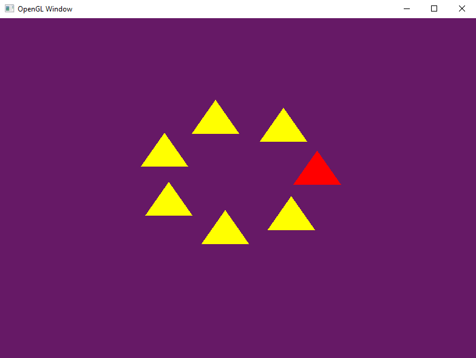
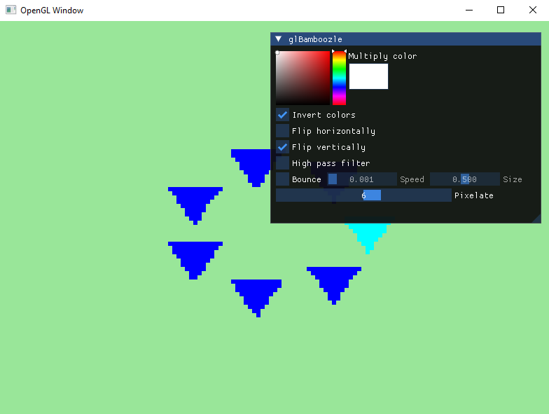

# glBamzoozle
*GlBamboozle* is a quite useless OpenGL driver loader. You probably do not want to use it for anything. If, for any number of reasons, you conclude you do want to use it, consider rethinking your decision. You've probably missed something crucial.

## What?
*GlBamboozle* lets you alter your experience with OpenGL applications (i.e. games). It's capable of completely *bamboozling* your displayed data by inverting it, making it blurry, dizzy, fuzzy or simply unbearable.

## How?
Every OpenGL application links to an [OpenGL runtime](https://learn.microsoft.com/en-us/windows-hardware/drivers/display/loading-an-opengl-installable-client-driver) located in `C:\Windows\System32\opengl32.dll` or `C:\Windows\SysWOW64\opengl32.dll` (depending on bitness). The runtime is a very thin middleware between the application and the actual vendor driver (e.g. from AMD or NVIDIA) which performs most of the graphics work. The runtime library is responsible for finding driver binary and forwarding all OpenGL API calls to it.

*GlBamboozle* is yet another middleware placed between application and runtime. It is named the same - `opengl32.dll` - so it will be automatically loaded instead of the runtime, whenever it is placed in application's binary directory. The bamboozle library will then load the original OpenGL runtime by its absolute path and forward all API calls to it. These calls can be altered by *glBamboozle* - removed, changed or even replaced by another ones. This is used to add additional effects to the screen. Most of the work is done in `wglSwapBuffers` which is WGL's entrypoint for displaying framebuffer on screen. *GlBamboozle* will insert additional rendering calls to create the effects selected by the user.

## Does it work?
That's the neat part, [it doesn't](https://knowyourmeme.com/memes/thats-the-neat-part-you-dont). The thing is, OpenGL is an incredibly complex, outdated, cluttered, inconsistent, unpredictable, spaghettified, confusing, mystical and suprising API to support. There are multiple ways to setup and use everything. I tested *glBamboozle* with some games and each of them didn't work for its own different reasons. This was meant to be a fun two-weekend project and I don't have the time to debug all of this and figure out fixes and workarounds. So yes, it works with simple hello world apps. And no, it doesn't work for most of the real world software.

## Why?
Out of boredom.

## How much effort did I give?
About 20%.

## How to build it?
Why would you even ask?

## When to download it?
Seriously, what the hell?

# What license?
[WTFPL](https://en.wikipedia.org/wiki/WTFPL), I guess.

## When?
April 1st.
